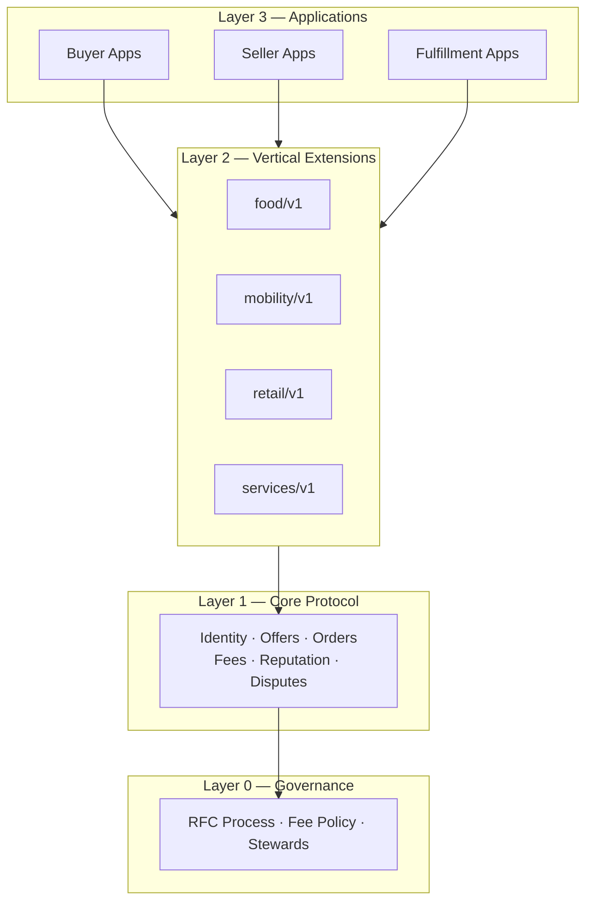
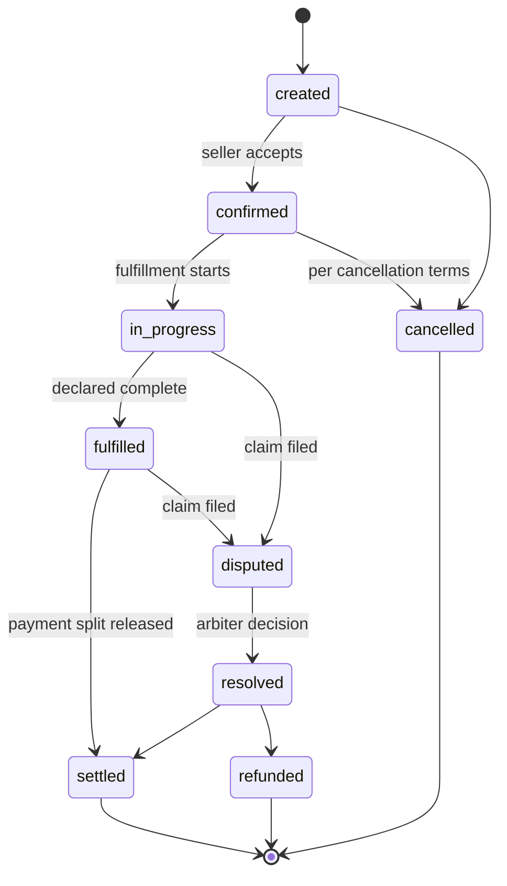
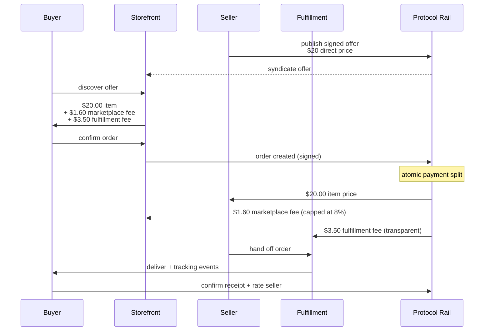

# The FairMarket Protocol: An Open Rail for Fair Digital Commerce

**Author:** Anirudh Allani
**Version:** 0.1 (draft) — October 2026
**Status:** This is a proposal paper, not a product. It exists to put the idea into the world in complete, referenceable form, so that others can criticize it, improve it, or build on it.
**License:** Apache License 2.0
**Repository:** https://github.com/AllaniAnirudh/fairmarket

---

## Abstract

Every major marketplace runs the same economics: the platform charges sellers 15 to 30 percent commission, sellers raise prices to cover it, and buyers pay the difference for the identical item. The platform also owns demand, identity, and reputation, so neither side can leave. This paper proposes FairMarket, an open protocol that separates the marketplace into a neutral rail and competing apps. Sellers publish one catalog at their direct price. Buyers pay that price plus one explicit, protocol-capped marketplace fee and a separate transparent fulfillment fee. Identity, listings, and reputation are portable across apps. The protocol defines the transaction lifecycle, the fee rules, the payment split, and dispute handling for every vertical through a generic core plus versioned extensions. The paper presents the problem with measured evidence, the full protocol design, a worked economic comparison, an adversarial analysis of how incumbents and attackers would respond, and a roadmap. It argues that the fix is structural, not behavioral: you cannot fix the platform tax by asking the tax collector to be generous.

## Contents

1. [The problem](#1-the-problem)
2. [Related work](#2-related-work)
3. [Design principles](#3-design-principles)
4. [System overview](#4-system-overview)
5. [Core protocol](#5-core-protocol)
6. [Economics: a worked example](#6-economics-a-worked-example)
7. [Trust, reputation, and disputes](#7-trust-reputation-and-disputes)
8. [Vertical extensions](#8-vertical-extensions)
9. [Governance](#9-governance)
10. [Adversarial analysis](#10-adversarial-analysis)
11. [Roadmap](#11-roadmap)
12. [Open questions](#12-open-questions)
13. [References](#13-references)
14. [Appendix A: Glossary](#appendix-a-glossary)
15. [Appendix B: How to cite this paper](#appendix-b-how-to-cite-this-paper)

---

## 1. The problem

### 1.1 The platform tax

The mechanism is identical across food delivery, ride hailing, e-commerce, and services:

1. The platform charges the seller a commission. Measured rates: food delivery 15 to 30 percent depending on tier (DoorDash, Uber Eats, Grubhub); ride hailing 30 to 45 percent effectively (Uber, Lyft); Amazon sellers 30 to 35 percent all-in once referral and fulfillment fees combine; Airbnb 15.5 percent host-only.
2. The seller cannot absorb it and raises prices on the platform. 70 to 80 percent of restaurants raise menu prices 15 to 25 percent on delivery apps. The platform price is not the direct price.
3. The buyer pays the difference. Total delivery markups reach 69 to 92 percent once item inflation, service fees, delivery fees, and tips stack up. One study found app delivery costing 79.5 percent more than pickup for the same order.

The seller is not greedy. They are covering the tax. The buyer is not careless. They have no alternative that shows them the direct price.

### 1.2 The lock-in

The commission is only half the problem. The platform also owns three things that make exit impossible:

- **Demand.** Buyers open the platform's app, not the seller's.
- **Identity.** The seller's profile exists inside the platform.
- **Reputation.** Ratings and reviews cannot be taken elsewhere.

A seller who leaves starts from zero. A buyer who leaves loses their history. Neither side can credibly threaten to walk away, so the platform can raise the tax at will. Market power sits with whoever controls discovery and identity, not with whoever has the best prices. This is why the pattern never self-corrects.

### 1.3 Why existing fixes fail

- **Price parity clauses**, in which platforms forbid sellers from charging less elsewhere, treat the symptom and entrench the disease. They have triggered antitrust lawsuits (see References).
- **Commission caps**, such as New York City's permanent 15 percent delivery cap, help sellers on paper, but platforms re-layer the cost as buyer-side junk fees instead of absorbing it. The buyer still pays; the fee just changes its name.
- **A cheaper competing app** faces the cold-start problem with no structural advantage, and incumbents respond with subsidies, exclusive contracts, and acquisitions. Worse, a winning cheap app becomes the next tax collector: the history of marketplaces is a cycle of undercutting followed by extraction.

None of these change who owns discovery, identity, and reputation. That is the structural fix this paper proposes.

---

## 2. Related work

### 2.1 UPI (India)

The Unified Payments Interface separated payments from payment apps. Merchants pay near zero, apps compete on experience, and no app can tax a transaction because none owns the rail. UPI is the closest proof that the separate-the-rail model works at national scale. FairMarket applies the same separation to commerce instead of payments.

### 2.2 ONDC and the Beckn protocol (India)

The Open Network for Digital Commerce, built on the Beckn protocol, is the direct predecessor of this design. Beckn defines a domain-agnostic core (discovery, ordering, fulfillment, post-fulfillment) with domain data carried as extensible values, and payments kept outside the protocol. ONDC reached 500 million cumulative transactions, proving the architecture works technically.

Its struggles are this paper's most important lessons:

- **The incentive cliff.** Growth stalled when subsidies were cut; users asked why they were there. Subsidies rent demand; they do not create it.
- **The trust gap.** The most-cited structural weakness of ONDC is the absence of centralized grievance redressal. FairMarket therefore puts disputes and reputation in the core protocol, not in the apps.
- **Leadership and focus.** Executive turnover and category sprawl followed the stall. A protocol project needs steady stewardship and narrow initial focus.

### 2.3 OpenBazaar (2014-2020)

A decentralized marketplace with no fees at all. It shut down for lack of user growth: roughly $44M in lifetime volume, no revenue model (it needed donations to survive), and moderation and support failures inherent to a fully decentralized model. Lesson: zero fees is not a strategy, and decentralization without trust infrastructure does not work. FairMarket keeps explicit fees and puts trust in the protocol.

### 2.4 Cooperatives and capped markets

The NYC Drivers Cooperative (worker-owned ride hailing, operating since 2021) proves sellers will organize against extraction, but it remains bounded by local regulation: a niche, not a rail. NYC's permanent 15 percent delivery commission cap proves regulation can move the number, but platforms re-layered costs onto buyers. Both confirm the diagnosis and the insufficiency of partial fixes.

### 2.5 Protocol precedents

ActivityPub, Matrix, and the AT Protocol show that open protocols can standardize ecosystems without owning them. Their governance and versioning practices inform this paper's Sections 9 and 11. None of them addresses commerce economics, which is FairMarket's contribution.

---

## 3. Design principles

1. **Participants own their data.** Identity, catalogs, order history, and reputation are portable. Apps are interchangeable views.
2. **Fees are explicit and capped.** The protocol sets a maximum marketplace fee. Apps may charge less, never more. The fee is its own line item on every order.
3. **Fulfillment is priced honestly, not hidden.** Delivery and transport cost real money. The protocol separates the fulfillment fee from the marketplace fee and demands transparency for it, instead of pretending one flat rate covers everything.
4. **The rail is neutral.** The protocol does not run a storefront, take a cut, or favor any participant. Anyone can implement it.
5. **Generic core, vertical extensions.** All commerce shares one transaction lifecycle. Vertical specifics are versioned extensions, not forks.
6. **Trust is shared infrastructure.** Ratings, verification, and dispute resolution live on the protocol so new apps and sellers never start from zero.
7. **Design generic, prove narrow.** The protocol is specified for everything; it must first be proven on one vertical in one place.

---

## 4. System overview

### 4.1 Actors

- **Buyer.** Discovers offers and places orders through a storefront app.
- **Seller.** Publishes offers and fulfills orders. Owns their catalog, identity, and reputation.
- **Storefront.** An app that presents offers and takes orders. Earns the marketplace fee, capped by the protocol. Competes on experience and on fee level at or below the cap.
- **Fulfillment provider (optional).** Handles delivery, transport, or logistics as a separate actor with its own transparent fee. May be the seller, an independent provider, or a storefront's logistics arm under the same transparency rules.
- **Arbiter.** Resolves disputes that automated rules cannot. Arbiters are registered participants with reputation at stake.

### 4.2 Layers



Layer 1 knows nothing about pizzas or rides. Layer 2 adds domain schemas. Layer 3 competes.

### 4.3 Guarantees

1. The price in an offer is the seller's direct price. No participant may inflate it.
2. The buyer sees every fee as an explicit line item before confirming. No hidden charges, no post-confirmation increases.
3. Payment splits atomically: seller, storefront, and fulfillment provider are paid in one settlement. No one holds another's money.
4. Identity and reputation are portable across apps.
5. Every order follows one auditable state machine; disputes follow one defined process.

### 4.4 Non-goals

FairMarket is not a delivery company, a storefront, or a new Uber. It is not a cryptocurrency project; settlement uses normal payment rails. It is not a plan to reform incumbents; they will not adopt it. It is not a charity; storefronts, fulfillment providers, and arbiters earn transparent fees, while the protocol itself takes nothing.

---

## 5. Core protocol

The core is the normative heart of FairMarket. The key words MUST, MUST NOT, SHALL, SHOULD, and MAY follow RFC 2119. The full normative text lives in `spec/04-identity.md` through `spec/09-disputes.md`; this section states the load-bearing rules.

### 5.1 Identity

Every participant holds a cryptographic identity (a keypair); the public key fingerprint is the protocol-level identifier. Identity is portable: storefronts MUST NOT require a separate non-portable account as a condition of transacting. Verification is tiered: self-asserted (Tier 0), document-verified (Tier 1), business-verified (Tier 2). A seller verified once is verified on every app. Verifiers are accredited participants whose own reputation is slashed for false attestations.

### 5.2 Offers

An offer is a signed promise: item or service, direct price, terms, validity window. The price MUST equal the seller's direct price. A storefront MUST display it exactly as signed and MUST NOT fold any surcharge into it. A seller MAY list on any number of storefronts; no storefront SHALL demand exclusivity or penalize multi-homing in ranking, visibility, or terms. Exclusivity clauses are a protocol violation.

### 5.3 Orders

Every order moves through one state machine, in every vertical:

```
created -> confirmed -> in_progress -> fulfilled -> settled
                   \-> cancelled
    disputed -> resolved -> settled | refunded
```

Transitions are signed by the responsible actor and appended to the order's history. The confirmed offer is snapshotted; later offer changes cannot affect a placed order. A storefront MUST NOT forge or alter order states.



### 5.4 Fees and payment split

Each order carries a `fee_breakdown` with up to three line items, all visible before confirmation:

1. **Item price** — the seller's direct price. Untouchable.
2. **Marketplace fee** — capped by protocol policy (initial cap: 8 percent of item price). A storefront MAY charge less, MUST NOT charge more, and there MUST be exactly one such line item: duplicate charges under different names are a protocol violation.
3. **Fulfillment fee** — set by the fulfillment provider, shown separately, and binding once confirmed. For mobility, the fare estimate at confirmation is the maximum charge.

Settlement MUST be atomic: seller, storefront, and fulfillment provider are paid in one operation. Escrow is available for high-value or made-to-order transactions.



The split exists because a single flat fee cannot work: on a $20 food order the rider payout alone is about $3 (15 percent), so an 8 percent all-in cap could not fund delivery without hidden charges or bankruptcy. Separating the fees keeps the marketplace fee small and honest while pricing fulfillment at its real, visible cost.

### 5.5 Reputation

Ratings are signed statements bound to protocol identities: one rating per completed order, per side. A storefront MUST submit collected ratings to the participant's portable record and MUST NOT withhold, alter, or selectively display them. Protocol-level fraud signals (chargeback rates, dispute rates, ban history) are shared across all apps, so a bad actor removed from one storefront cannot start clean on another.

### 5.6 Disputes

Standard claim types across verticals: not delivered, wrong item, damaged or defective, no-show, quality dispute. Filing moves the order to `disputed` and freezes settlement. Published automated rules resolve the clear cases; the rest go to registered arbiters with disclosed conflicts of interest, whose decisions are binding. Outcomes (release, partial refund, full refund, redo) are recorded and affect reputation. The dispute rule set and arbiter accreditation criteria are public; secret rules are a protocol violation.

---

## 6. Economics: a worked example

Consider a $20 menu item at an independent restaurant. Assumptions are stated; the arithmetic is illustrative, built from the measured rates in Section 1.

**On an incumbent delivery app (30 percent commission tier):**

| Line | Amount |
|---|---|
| Menu price (inflated ~20 percent to cover commission) | $24.00 |
| Service fee | $3.49 |
| Delivery fee | $2.99 |
| **Buyer total before tip** | **$30.48** |
| Restaurant receives (24.00 minus 30 percent) | $16.80 |

**On FairMarket:**

| Line | Amount |
|---|---|
| Item price (direct price, no inflation) | $20.00 |
| Marketplace fee (8 percent, explicit) | $1.60 |
| Fulfillment fee (transparent delivery cost) | $3.50 |
| **Buyer total before tip** | **$25.10** |
| Restaurant receives | $20.00 |

The buyer saves roughly $5.40 on the same order. The restaurant keeps $3.20 more. The storefront earns $1.60 for discovery, ordering, payments, and support, and the delivery provider earns a transparent $3.50. Nobody is subsidizing anybody; the savings come from removing the extraction, not from burning venture capital.

Three properties make this stable rather than promotional:

1. **The seller has no reason to inflate.** The 8 percent fee is small enough to absorb, and inflating the base price is a protocol violation.
2. **The buyer sees the whole truth.** Every fee is a line item before confirmation. There is nothing to discover at checkout.
3. **Competition moves the fee down, not up.** Storefronts compete by charging less than the cap. The cap only moves through the highest-scrutiny governance track, publicly, or not at all.

---

## 7. Trust, reputation, and disputes

Trust is the binding constraint on adoption. ONDC's most-cited structural weakness is the absence of centralized grievance redressal; users stay where problems get resolved, not where fees are 2 percent lower. FairMarket therefore treats trust as protocol infrastructure:

- **Verification tiers** gate what sellers can do, so high-value categories require real identity.
- **Portable reputation** means a seller's history follows them, which makes good behavior valuable and bad behavior expensive everywhere at once.
- **Shared fraud signals** mean ban evasion by app-hopping does not work.
- **The dispute process** (Section 5.6) gives every order a defined path from claim to binding resolution, with public rules and accountable arbiters.

The honest admission: trust infrastructure is expensive to operate, and who funds human arbitration is still an open question (Section 12). The protocol is designed so the answer can be a small per-order pool, loser-pays, or a foundation grant, without changing the core.

---

## 8. Vertical extensions

Extensions are namespaced, versioned packs (`food/v1`, `mobility/v1`, `retail/v1`, `services/v1`) that add to the core without changing it. Each defines item schema additions, fulfillment events for the order's `in_progress` state, SLA fields, rating dimensions, and claim subtypes. The core and each extension are versioned independently: a change to `food/v1` never forces a core release. If two extensions conflict, the core definition wins.

- **food/v1:** menu structure with variants and modifiers; events `accepted, preparing, picked_up, arriving, delivered`; prep-time and temperature fields.
- **mobility/v1:** pickup/dropoff coordinates, vehicle class; events `driver_assigned, driver_arriving, trip_started, trip_completed`; binding fare estimate.
- **retail/v1:** SKU, inventory, condition grading; events `packed, shipped, in_transit, out_for_delivery, delivered`; structured returns policy.
- **services/v1:** scope of work, time-slot booking, optional quote-before-order flow, milestone settlement for large jobs.

Anyone may propose a new extension through the RFC process. The full sketches live in `spec/10-extensions.md`.

---

## 9. Governance

The protocol needs a steward that cannot become the next rent extractor. The preferred long-term form is an independent nonprofit foundation funded by grants and membership dues, with a public RFC process. Until the ecosystem warrants that, the founder stewards the spec, with every decision made in the open.

Load-bearing rules:

- **Rough consensus, recorded rationale.** Proposals move forward when objections are heard and addressed. Nothing substantive happens in private.
- **The fee cap is constitutional.** Changing the cap or the one-explicit-fee rule requires the highest scrutiny track: extended public review, written rationale, no silent changes.
- **RFC process for everything structural.** New extensions, core changes, fee policy, and governance changes all go through numbered public RFCs (see `RFC_PROCESS.md`).
- **The charter must outlive its authors.** The foundation's founding documents permanently encode the fee cap's change process and the rail's neutrality, so no future steward can quietly become the tax collector.

---

## 10. Adversarial analysis

A paper like this must survive its enemies. Here are the attacks, and the defenses.

**Incumbent undercutting.** The platform temporarily cuts its own fees or subsidizes orders during the pilot. Defense: subsidies end; the protocol's fees are structural, not promotional. Sellers multi-home, so they take the incumbent's discount while keeping their FairMarket listing. The pilot must measure retention after promotions end, not during them.

**Exclusive contracts.** The platform demands sellers delist elsewhere or face worse placement. Defense: exclusivity is a protocol violation, and the legal trend is against it (antitrust suits over parity and exclusivity clauses are already filed). Public enforcement in the pilot's first month sets the precedent.

**Fee evasion by storefronts.** A storefront reintroduces stacked fees under new names. Defense: the one-line-item rule is machine-checkable. Non-compliant storefronts are publicly flagged and delisted from compliant directories. Reputation does the rest.

**Reputation gaming.** Fake reviews, Sybil ratings, review extortion. Defense: tiered verification, one rating per completed order per side, protocol-level fraud signals shared across apps, and dispute outcomes recorded alongside ratings.

**Dispute flooding.** Bad-faith claims to harass sellers or extract refunds. Defense: frivolous filing is itself a reputation event, and arbitration costs are assigned to the losing party once the funding model is set.

**Regulatory capture.** Incumbents lobby to define the rules. Defense: the foundation model, public RFCs, and a charter that cannot be quietly amended. Also candor: this defense is organizational, not technical, and it is the weakest link. It must be built before it is needed.

**The cold start.** The central risk, stated plainly: a protocol with no users is a document. The defense is the phased roadmap (Section 11): prove the economics with one vertical in one city, with sellers who feel the tax sharply enough to move, before asking anyone to believe in the generality.

---

## 11. Roadmap

- **Phase 1 (this paper):** the idea in complete, referenceable form. Done when the design survives public criticism.
- **Phase 2 — Reference implementation:** core protocol plus `food/v1`, one buyer app, one seller app, conformance test vectors. Done when two independent implementations complete an order end to end.
- **Phase 3 — Pilot:** food delivery in one metro area with independent restaurants. Done when sellers list at true direct prices, buyers pay less than on incumbents for the same order, and sellers renew after the pilot.
- **Phase 4 — Expansion:** `mobility/v1` first (same economics, different fulfillment, stress-tests the core), then retail and services. Done when a vertical ships with zero changes to the core.
- **Phase 5 — Maturity:** independent foundation, elected stewards, third-party audits of fee enforcement.

Gating discipline: no phase begins until the previous one's success criteria are met and published. Generality is earned by evidence, not asserted by design.

---

## 12. Open questions

1. **Fee cap value.** 8 percent is a starting proposal for the marketplace fee. It may need to differ by vertical, and the process for changing it must be proven before v1.0.
2. **Arbitration funding.** Per-order dispute pool, loser-pays, or foundation grant. Undecided; to be settled by RFC.
3. **Fulfillment interface.** The protocol coordinates fulfillment but owns no fleets. The interface for independent logistics providers needs design.
4. **Funding the rail.** Reference implementation and early operations need funding before the ecosystem sustains itself.
5. **Regulatory posture.** Money transmission, food safety liability, and transport regulation differ by jurisdiction. The protocol must remain infrastructure, never the merchant of record.
6. **Trademark and name protection.** Needed before public launch so the protocol's name cannot be captured.

---

## 13. References

- Bill Gurley, on marketplace take rates ("start above 10 percent; you can move down, never up").
- Chris Dixon (2017), on why open protocols lose to centralized services; 2024 AEI transcript on the attract-extract cycle.
- ONDC public reporting: 500M cumulative transactions (July 2026); ~4.3 percent e-commerce penetration vs incumbents' ~83 percent; incentive reductions and their effect on growth; PhonePe Pincode's category exits (2024-2025).
- Beckn protocol specification: domain-agnostic core with extensible domain values; payments kept outside the protocol.
- Davitashvili v. Grubhub et al., S.D.N.Y. No. 20-03000 (2020): challenge to "No Price Competition Clauses."
- New York City delivery commission caps (15 percent, made permanent August 2021); platforms' 2021 challenge and June 2025 settlement accepting the caps.
- NELP (October 2026) on fee-driven meal price inflation; LendingTree (November 2025) on pickup-vs-delivery price gaps; FinanceBuzz on total delivery markups.
- OpenBazaar retrospective (2014-2020): shutdown for lack of user growth; no revenue model; decentralized moderation failures.
- NYC Drivers Cooperative (operating since 2021): worker-owned ride hailing, bounded by local regulation.
- W3C Patent Policy (royalty-free licensing of Essential Claims) as the institutional alternative to Apache 2.0 Section 3's patent grant.
- RFC 2119 (Bradner, 1997): conformance language used in this specification.
- Contributor Covenant 2.1: the project's code of conduct.

---

## Appendix A: Glossary

- **Direct price:** the price a seller charges for an item or service outside any platform. The protocol price MUST equal it.
- **Marketplace fee:** the storefront's fee for discovery, ordering, payments, and support. Capped by the protocol, exactly one line item.
- **Fulfillment fee:** the fee for delivery, transport, or logistics. Transparent and binding once confirmed.
- **Offer:** a seller's signed, public promise of an item or service at a price under terms.
- **Order:** a buyer's confirmed commitment against an offer, moving through the protocol state machine.
- **Storefront:** an app that presents offers and takes orders; earns the marketplace fee.
- **Arbiter:** a registered participant who resolves disputes the automated rules cannot.
- **Extension:** a namespaced, versioned pack adding vertical-specific schemas to the core.
- **Protocol violation:** breaking a MUST/MUST NOT rule. Violations are public and affect standing.
- **Rail:** the neutral protocol infrastructure, as distinct from the apps built on it.

## Appendix B: How to cite this paper

Allani, Anirudh. "The FairMarket Protocol: An Open Rail for Fair Digital Commerce." Version 0.1 (draft), October 2026. Apache License 2.0. https://github.com/AllaniAnirudh/fairmarket

---

*This paper supersedes the earlier `ARCHITECTURE.md` draft, whose content has been incorporated and expanded here. The detailed normative text lives in `spec/`; this paper is the canonical statement of the idea.*
