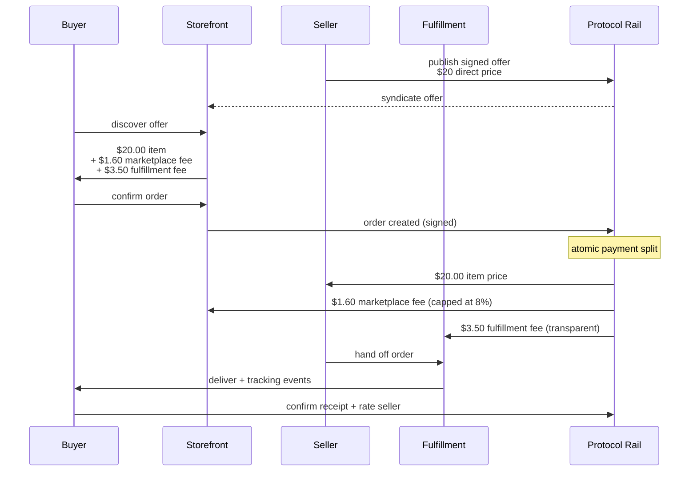
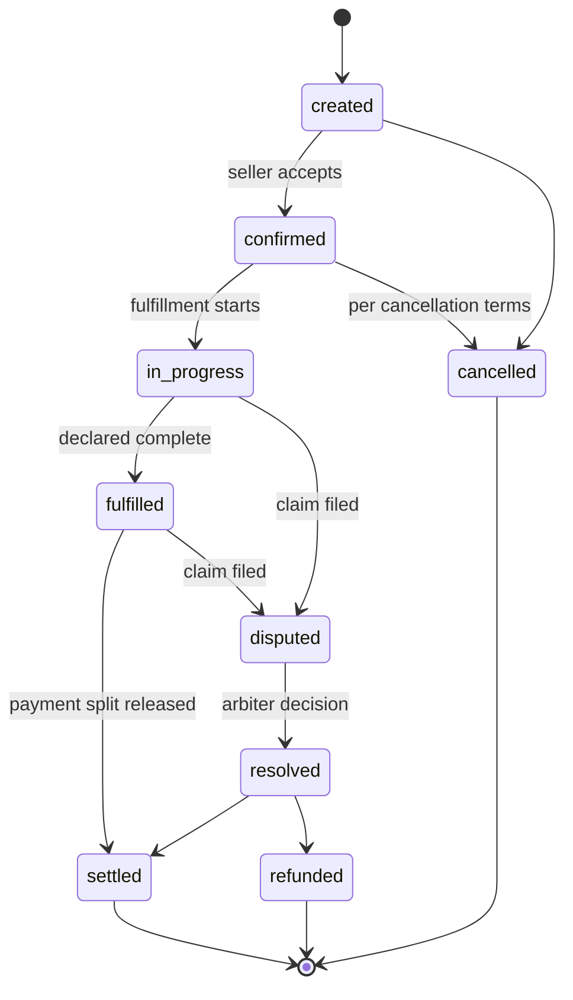
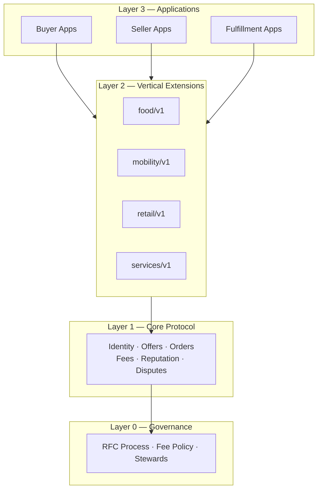

# FairMarket Diagrams

Mermaid diagrams that render natively on GitHub. They are also embedded in [PAPER.md](../PAPER.md) where they belong in the narrative.

## 1. Transaction and money flow

How an order moves through the system and how the money splits. This is the core of the idea.

## 2. Order lifecycle

The one state machine every vertical uses. Transitions are signed by the responsible actor.

## 3. Layered architecture

